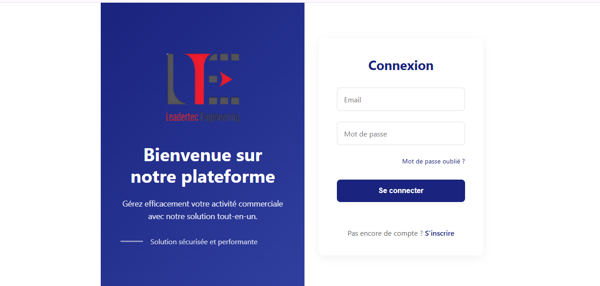
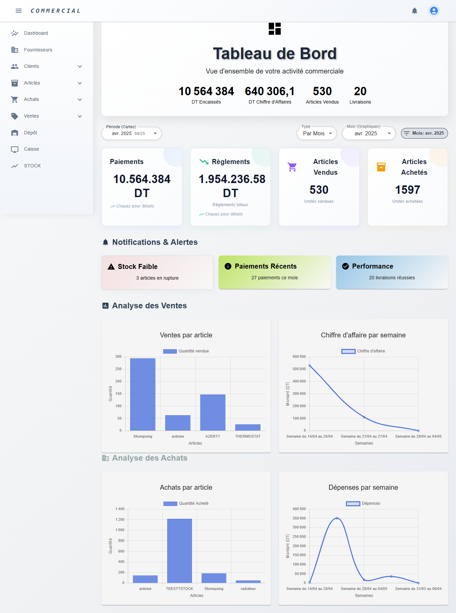
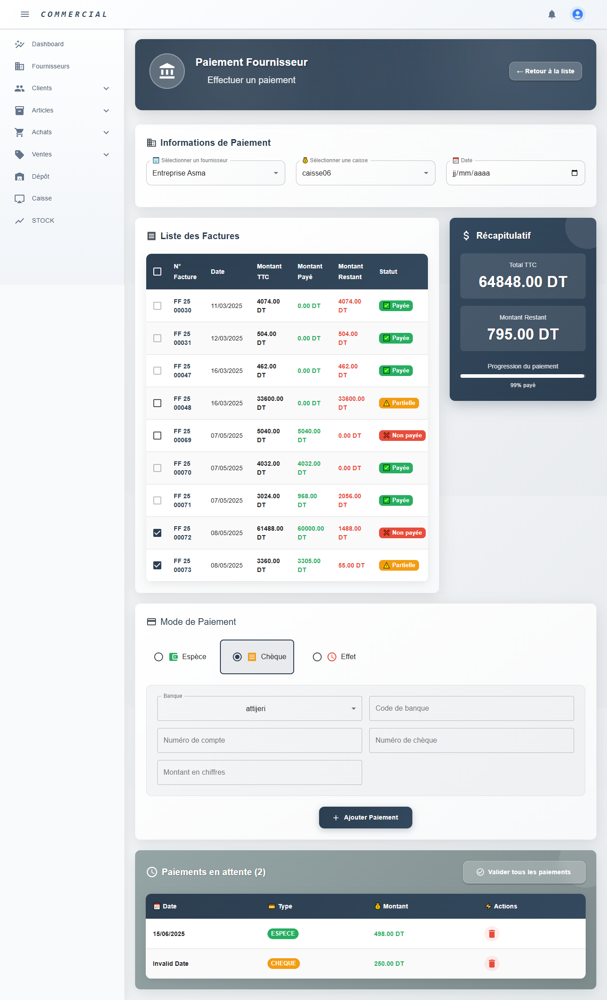
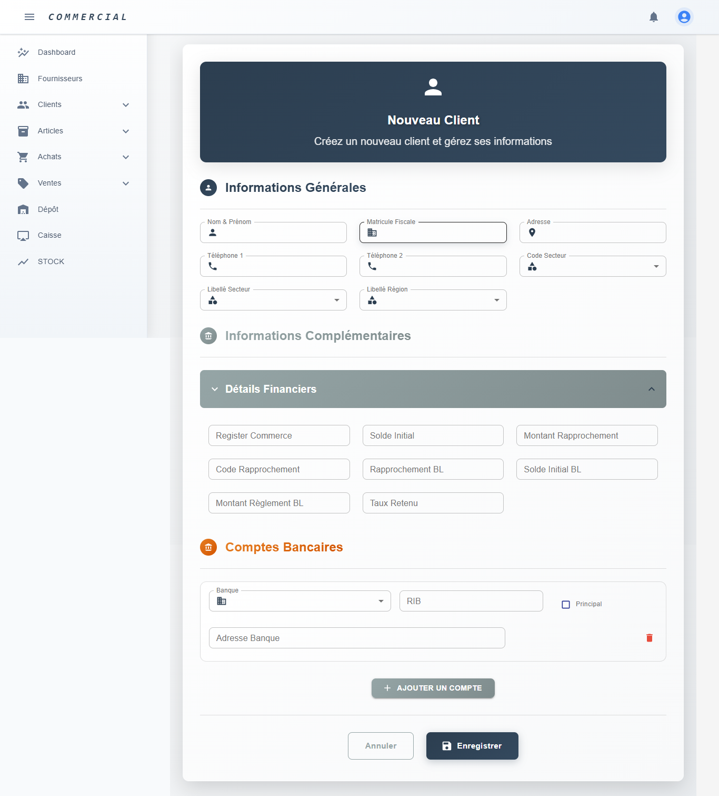

# Développement de module COMMERCIAL d'un ERP 
Application web moderne de gestion commerciale intégrant les modules **Achats, Ventes et Stock**, avec automatisation des flux, suivi des opérations, gestion des clients et fournisseurs, suivi du stock et génération de documents PDF.

## 📱 Screenshots

### Login

### Dashboard

### Paiement Fournisseur

### Ajout de client

